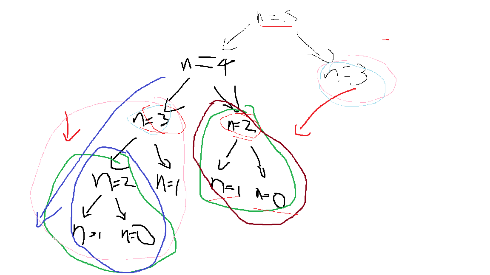

# Sucesión de Fibonacci: recursión e iteración

Este directorio contiene un ejemplo didáctico para comparar dos formas de calcular
números de la sucesión de Fibonacci en Python:

- `fibonacci_recursivo(n)`: usa recursión.
- `fibonacci_iterativo(n)`: usa un ciclo `for`.

El archivo principal es `fibonacci_recursivo_e_iterativo.py`.

## Objetivo del script

El script muestra cómo resolver el mismo problema computacional usando dos
estrategias distintas:

1. **Recursión**: una función se llama a sí misma para resolver versiones más
   pequeñas del problema.
2. **Iteración**: un ciclo actualiza variables hasta llegar al resultado buscado.

La sucesión de Fibonacci se define así:

```text
F(0) = 0
F(1) = 1
F(n) = F(n - 1) + F(n - 2), para n >= 2
```

Por ejemplo:

```text
F(8) = 21
F(45) = 1134903170
```

## Función recursiva

La función `fibonacci_recursivo(n)` calcula el número de Fibonacci en la posición
`n` usando directamente la definición matemática de la sucesión.

```python
def fibonacci_recursivo(n):
    if n == 0:
        return 0
    elif n == 1:
        return 1
    else:
        return fibonacci_recursivo(n - 1) + fibonacci_recursivo(n - 2)
```

Los casos `n == 0` y `n == 1` son los **casos base**. Estos son importantes
porque detienen la recursión. Sin casos base, la función seguiría llamándose a sí
misma indefinidamente.

El caso `n >= 2` es el **caso recursivo**. Allí la función calcula el resultado
sumando los dos números anteriores de la sucesión.

## Diagrama de llamadas recursivas



La imagen ilustra cómo se descompone el cálculo recursivo. Por ejemplo, para
calcular un valor como `F(5)`, la función necesita calcular primero `F(4)` y
`F(3)`. Luego `F(4)` se descompone en `F(3)` y `F(2)`, y así sucesivamente hasta
llegar a los casos base `F(1)` y `F(0)`.

Este árbol de llamadas ayuda a ver un punto clave: algunos cálculos se repiten.
Por ejemplo, `F(3)`, `F(2)` y `F(1)` aparecen varias veces en distintas ramas.
Por eso la versión recursiva simple es fácil de entender, pero puede ser lenta
cuando `n` crece. Su complejidad temporal aproximada es `O(2^n)`.

## Función iterativa

La función `fibonacci_iterativo(n)` calcula el mismo resultado usando un ciclo.
En lugar de abrir muchas llamadas recursivas, guarda solamente dos valores:

- `a`: el valor actual.
- `b`: el siguiente valor.

En cada iteración se actualizan ambos valores con:

```python
a, b = b, a + b
```

Esto significa que el valor siguiente pasa a ser el actual, y la suma de los dos
valores anteriores pasa a ser el nuevo siguiente valor.

Esta versión suele ser más eficiente para valores grandes de `n`, porque recorre
la sucesión una sola vez. Su complejidad temporal es `O(n)` y usa memoria
constante, es decir, `O(1)`.

## Cómo ejecutar el script

Desde esta carpeta, se puede ejecutar:

```powershell
python fibonacci_recursivo_e_iterativo.py
```

El script imprime los resultados de calcular `F(8)` y `F(45)` con ambas
estrategias.

## Nota importante

Las funciones están pensadas como ejemplo académico. Se asume que `n` es un
número entero mayor o igual que cero. El script no incluye validaciones para
valores negativos, decimales u otros tipos de datos.
